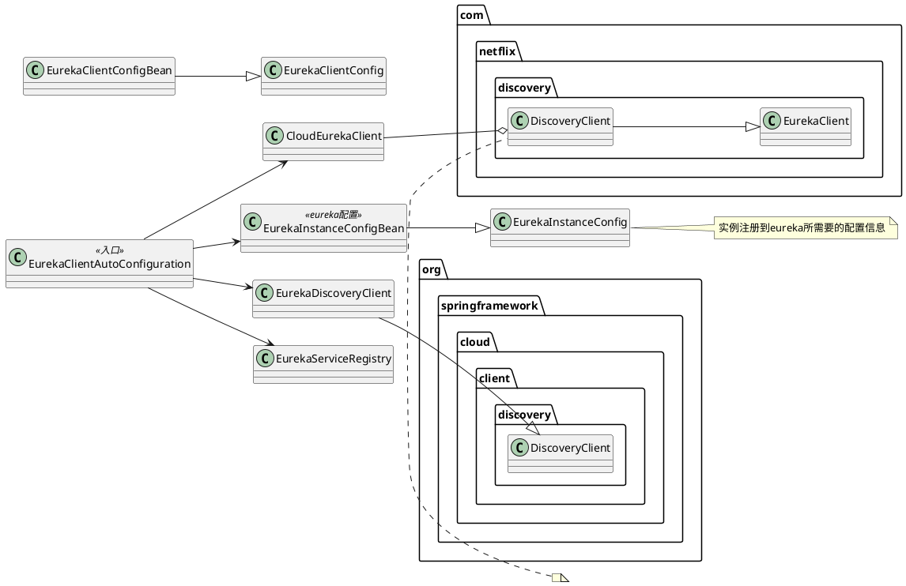
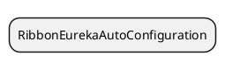
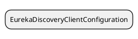
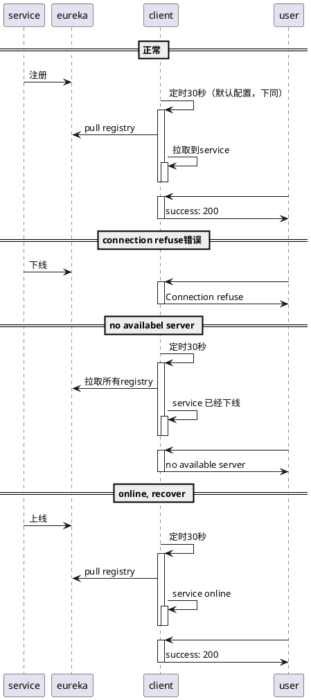

尝试重现com.netflix.client.ClientException: Load balancer does not have available server for client错误

怎么重现？

待解决问题：

- [x] 依赖的服务退出之后，并且没有服务起来，就会出这个错误
- [ ] eureka 跟 ribbon 是怎么结合起来工作的
- [ ] ribbon PollingServerListUpdater的定时任务在干啥？

# 推测

# Eureka 核心

- region, zone
  region：地区，zone：机房
- 注册之后，会定时上报心跳
- 正常退出的时候会发cancel消息 com/netflix/discovery/DiscoveryClient.java:923

# 阅读代码







DiscoveryClient

- EurekaTransport 跟Eureka服务通信的类
- AzToRegionMapper 包含映射可用区到区域映射的契约的接口。 一个实现总是事先知道将从映射器查询哪个区域到区域的映射，这将有助于事先缓存这些信息。

```text
这个类，是有助于与Eureka Server交互的类。Eureka Client用于处理：
a. 注册Eureka Server实例
b. 周期更新Eureka Server的lease
c. 在关闭时释放Eureka Server的lease
d. 查询Eureka Server上service/实例列表

cacheRefreshExecutor 定时同步eureka register
com.netflix.discovery.DiscoveryClient#refreshRegistry 同步eureka register实际执行方法
```

```puml
@startuml
class RefreshableEurekaClientConfiguration <<spring-cloud-starter>>

class DiscoveryClient
note top: eureka核心初始化类

class CloudEurekaClient
note top : 继承包装DiscoveryClient 

class Appliclations <<com.netflix.discovery.shared>>
note top of Applications
包装所有从eureka server返回的registry信息。
所有的Registry信息都是从EurekaClientConfig.getRegistryFetchIntegerValSeconds()中定义的eureka server中获取。
拉取到Registry之后，会打乱顺序，根据EurekaClientConfig.shouldFilterOnlyUpInstances()配置和InstanceStatus.UP状态来过滤实例。
end note

class ThresholdLevelsMetric
note top of ThresholdLevelsMetric
// todo
end note

RefreshableEurekaClientConfiguration -> CloudEurekaClient
CloudEurekaClient -> DiscoveryClient
DiscoveryClient -> Appliclations
@enduml
```

### 同步eureka register流程


# Ribbon

- ribbon.eureka.enabled 默认为true，设置false时是为了在不使用eureka的场景使用ribbon，比如目前测试环境，没有eureka
  如果在有eureka时设置，会出现not have available server问题
- PollingServerListUpdater在访问时，会初始化，并启动定时任务
  - com.netflix.loadbalancer.DynamicServerListLoadBalancer.updateListOfServers
  - org.springframework.cloud.netflix.ribbon.eureka.DomainExtractingServerList
  - com.netflix.niws.loadbalancer.DiscoveryEnabledNIWSServerList